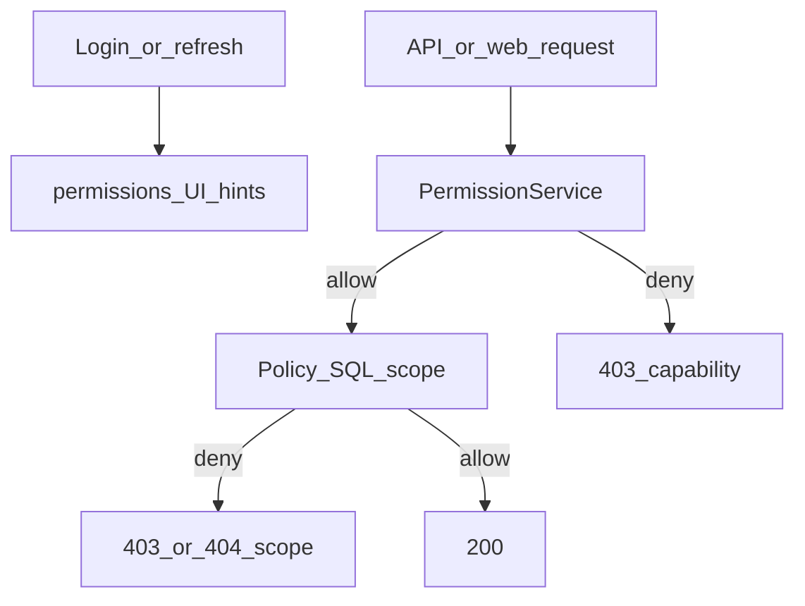

# Authn/authz matrix, Mkhdom, and token hardening

Reviewed by Grok, Claude, GPT, and Kimi (two rounds). Locked product choices: **Mkhdom is a PersonRole you assign**; **full replace of hardcoded role gates** in this program of work; **lectures/media content detection is later** (stubs only).

Two repos: [ShamandoraScout](https://github.com/kiroloskhela/ShamandoraScout) and adjacent [shamandora-Mobile-App](/Users/kiroloskhela/Desktop/scout/shamandora-Mobile-App).

**Waves 0–4: Laravel only. No changes in the Mobile repo.** The app already in users’ hands keeps working because Wave 4 seeds API keys to match today’s staff access (same Bearer token, same endpoints). Do **not** create Mkhdom accounts until Wave 5 — the current app would still show them leader tabs.

**Wave 5: first Mobile repo work** (PermissionStore, Mkhdom shell, client token refresh). Backend Wave 5 pieces (`/me`, `attendance/mine`, refresh-family) ship first; then the Flutter release that *enforces* permissions. Old app + new backend must still work (`role_names` fallback).

## Invariants (non-negotiable)

- **Capability vs scope.** The matrix answers “may this role use this feature?” Policies/SQL still decide which rows. `/api/me` and `/api/attendance/mine` take identity only from the authenticated user, never from a client `id`.
- **Client permissions are untrusted.** Login/refresh/`/me` return `permissions[]` for UI. Every request is re-checked on the server. Turning a key off 403s the next call without re-login.
- **SuperAdmin is outside the matrix.** One greppable `User::isSuperAdmin()` reads `PersonRole` from DB (never the permission cache). The SuperAdmin **Roles row is immutable** (cannot rename/delete). Last SuperAdmin **PersonRole** cannot be removed (transaction + row lock in [PersonRoleController](app/Http/Controllers/PersonRoleController.php) / [RoleController](app/Http/Controllers/RoleController.php), not a Gate that SuperAdmin would bypass). Matrix editor, SA assignment, admin password reset, audit purge, security config are **non-grantable**.
- **Fail-closed, except cache miss.** Unknown permission key = deny + log. Cache **errors** = deny. Cache **miss** = read DB and fill (so `cache:clear` does not 403 the site). `PERMISSIONS_ENFORCE` default **false** means **old `checkAuth` still runs**, never “no gate”.
- **Key grammar** `{platform}.{domain}.{action}` with `platform` in `web|mobile|api`, enforced by a test on [config/permissions.php](config/permissions.php).
- **Keep `role_names`** on login for display and old-app fallback.

## Wave 0 — Inventory

Write a catalog (route / controller / policy → current gate → proposed key). Cover [routes/web/*.php](routes/web), [routes/api.php](routes/api.php), all [app/Policies](app/Policies), and inline RoleName checks ([AttendanceController](app/Http/Controllers/AttendanceController.php) reservation bypass, [PersonSpecialCaseApiController](app/Http/Controllers/API/PersonSpecialCaseApiController.php)). [NotificationController](app/Http/Controllers/NotificationController.php) RoleName lookup is **audience targeting**, not authz — leave it.

Seed from **server truth** (bug-for-bug), not the sidebar. Known UI bugs (Media upload link, Secretary waiting list) stay seeded as **server** behavior; tightening is a later signed commit.

Generated dual-run test: each gated web route × each `Roles` row, old gate == matrix.

## Wave 1 — Schema + SuperAdmin page (old gates still on)

- Table `role_permissions` (`RoleID`, `permission_key`, unique pair).
- `PermissionService`: union of keys across the user’s roles; per-request memoize; auth-version counter bumped in the **same transaction** as matrix, PersonRole, and SuperAdmin changes.
- SuperAdmin page under the SuperAdmin tab: pick a role, toggle **Web / Mobile / API** grantable keys, danger confirm, optimistic version, **web POST + CSRF**, audit (actor, role, before/after, IP). Password re-confirm on save.
- Idempotent **additive** seeder (never deletes grants).
- Short ADR in `context/` for capability vs scope + non-grantable list.

## Wave 2 — Web cutover (own deploy)

Replace `checkAuth:RoleA|RoleB` with `can.permission:web.…` in [routes/web/*.php](routes/web). Keep [CheckAuthentication](app/Http/Middleware/CheckAuthentication.php) registered for revert. Sidebar in [layouts/app.blade.php](resources/views/layouts/app.blade.php) uses permission flags, not `$isSecretary`. Middleware after `auth` so guests still hit login, not fail-closed 403. HTML 403 for web.

## Wave 3 — Policies (own deploy, at least one day after Wave 2)

Swap RoleName lists for permission keys; **keep** Qetaa / group / owner SQL. Split [PersonPolicy](app/Policies/PersonPolicy.php) **view / update / delete** (Mkhdom must not inherit delete-self). Enrolment unscoped stays a separate danger key, seeded only to roles that have it today. Same enforce flag with RoleName fallback.

## Wave 4 — API default-deny **before any Mkhdom user**

Put `can.permission` on the whole `auth:sanctum` group in [routes/api.php](routes/api.php). Missing key = **deny by construction** (not only a CI test). Per-route override for the key. Leaders keep today’s behavior via seed (`api.attendance.take` for current staff, not Mkhdom). Route-table test is a second net.

JSON 403 for API. Distinguish capability vs scope in the JSON `code` so Flutter does not refetch `/me` on a Qetaa 403.

## Wave 5 — Mkhdom + Flutter + tokens (server first)

**Mkhdom:** seed RoleName `Mkhdom`. Default keys: `mobile.profile.own`, `mobile.attendance.own`, `mobile.lectures.own`, `mobile.media.own` (last two stubs). No members list, no take-others attendance, no web admin. SuperAdmin assigns the role **and** a password via existing [AdminPasswordController](app/Http/Controllers/AdminPasswordController.php) (no password = cannot login — [LoginApiController](app/Http/Controllers/API/LoginApiController.php) already requires `PersonSystemPassword`). Per-account login throttle. Lectures/media **bodies** stay empty until you specify detection.

**APIs:** `GET /api/me`, `GET /api/attendance/mine` (paginated, throttled, Auth-only). Login + refresh + `/me` return `role_names` and `permissions`.

**Tokens (root cause of “logout to fix it”):** stop rotating the refresh token on every access refresh (lost response currently revokes the only refresh). Issue a new **access** token; refresh lasts 30 days until logout, expiry, or theft. Family id per login; reuse of a revoked refresh revokes **that family** (not every device). Concurrent refresh: row lock. Password reset / SA strip revokes that user’s families. Access tokens tied to family so reuse can revoke them.

**Flutter** ([api_client.dart](/Users/kiroloskhela/Desktop/scout/shamandora-Mobile-App/lib/services/api_client.dart), [user_roles_service.dart](/Users/kiroloskhela/Desktop/scout/shamandora-Mobile-App/lib/services/user_roles_service.dart), [app_router.dart](/Users/kiroloskhela/Desktop/scout/shamandora-Mobile-App/lib/router/app_router.dart)): PermissionStore; if `permissions` missing, fall back to `role_names`. Hide leader tabs without keys. Proactive refresh ~60s before access expiry; refresh **only on 401**, never 403; 403 capability → refetch `/me` once; refresh fail → `AuthUnauthenticated`. Logout clears store. Debug `admin/123456` SuperAdmin **not in release builds**.

## Signed tightenings (separate commits, after dual-run is green in prod)

- Curricula: stop “any authenticated user may CRUD” ([CurriculaPolicy](app/Policies/CurriculaPolicy.php)); manage = SuperAdmin until you grant others.
- Sidebar vs server mismatches: fix UI to match server, or grant Media/Secretary the missing keys — your call in that commit.

## Tests (merge blockers)

- Dual-run web matrix vs old `checkAuth`.
- API route table: every authenticated route has a key.
- Last SuperAdmin cannot be removed; SuperAdmin Roles row cannot be deleted/renamed.
- Mkhdom: `/me` and `/attendance/mine` 200; `/attendance/save` and `/show-persons` 403; cannot delete self.
- Refresh: concurrent refresh safe; revoked family reuse 401; access still refreshable after 1h without new refresh token.
- Matrix CSRF + non-grantable keys rejected.
- Flutter: 401 refreshes, 403 does not.

## Rollback

Seeder never deletes. Revert route files to restore `checkAuth`. SuperAdmin bypass cannot be seeded away. Flutter with old backend still uses `role_names`.